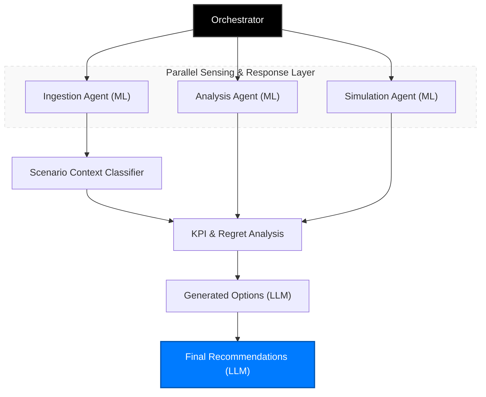
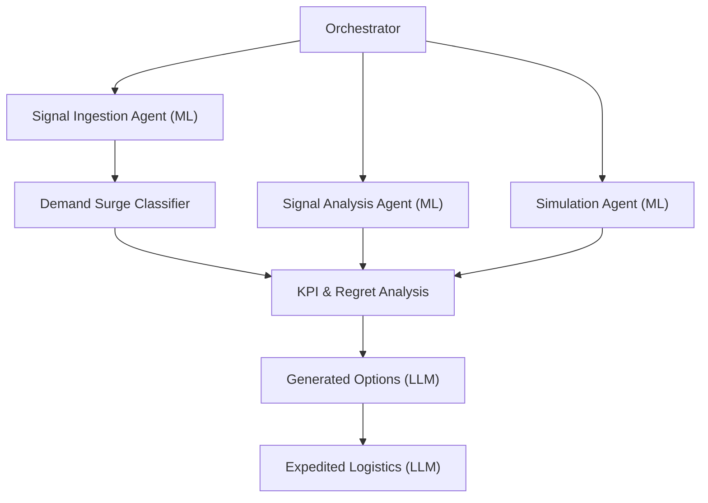
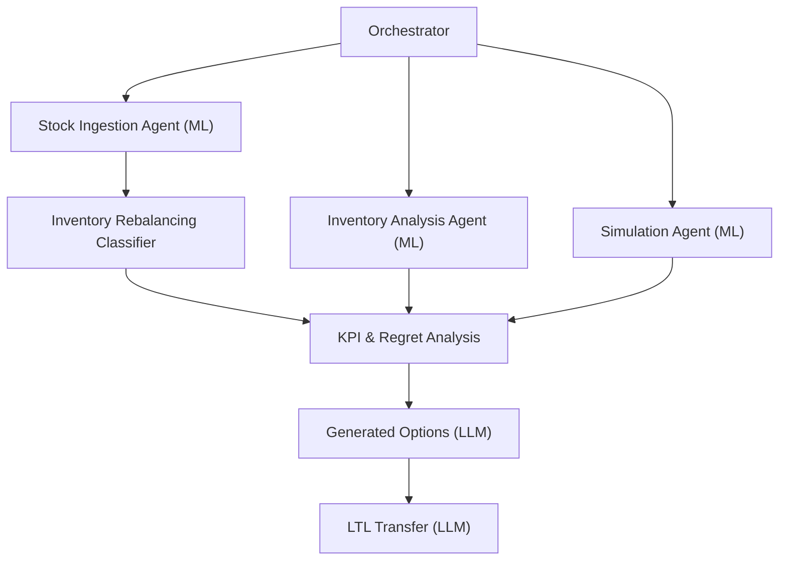
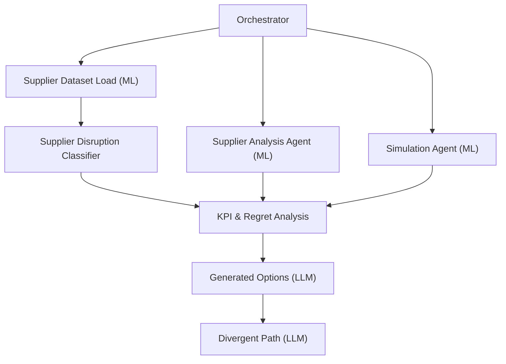

# Nike Supply Chain Scenario Flowcharts - Hierarchical View

This document provides a hierarchical representation of the Nike Supply Chain Control Tower's parallel orchestration logic.

## 🏆 Master Orchestration Hierarchy
This diagram represents the core architectural pattern used for all scenarios (Demand Surge, Inventory Rebalancing, and Supplier Disruption).



---

## 🌩️ Scenario 1: Demand Surge
Focuses on capturing consumer demand spikes and identifying logistics gaps.



---

## 📦 Scenario 2: Inventory Rebalancing
Optimization logic for redistributing stock across the DC network.



---

## 🚢 Scenario 3: Supplier Disruption
Mitigation strategies for production bottlenecks and factory delays.



---

## 🧬 Data Sourcing & Ingestion Pipeline
Granular view of the external and internal sensing layer.

```mermaid
flowchart TD
    subgraph Sources["Raw Data Sources"]
        Social[Social Media APIs]
        Weather[Weather & News]
        POS[Retailer POS (EDI)]
        ERP[SAP/o9 Inventory]
    end

    subgraph Preprocessing["Pre-Processing Layer"]
        Cleaning[Data Cleaning]
        Vector[NLP Vectorization]
        Norm[Min-Max Normalization]
    end

    subgraph Ingestion["Agent Ingestion Phase"]
        SIG["Signal Ingestion Agent (ML)"]
        INV["Inventory Ingestion Agent (ML)"]
    end

    Social --> Cleaning
    Weather --> Cleaning
    POS --> Vector
    ERP --> Norm

    Cleaning --> SIG
    Vector --> SIG
    Norm --> INV

    SIG --> OBJ_SIG[Signal Object]
    INV --> OBJ_INV[Inventory Objects]

    OBJ_SIG --> ORC[Orchestrator]
    OBJ_INV --> ORC[Orchestrator]
    
    style Sources fill:#f5f5f5,stroke:#333,stroke-dasharray: 5 5
    style Ingestion fill:#e1f5fe,stroke:#01579b
```
